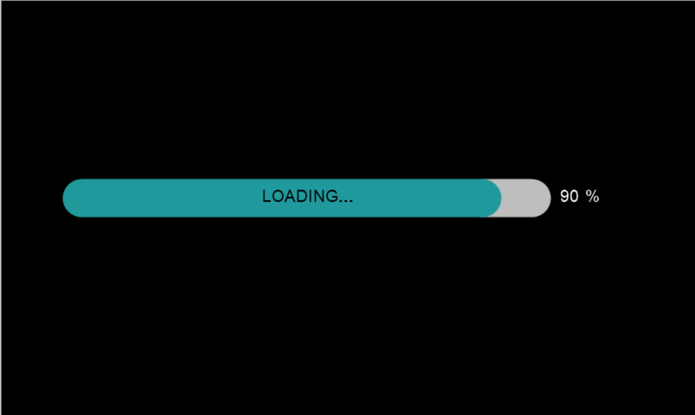
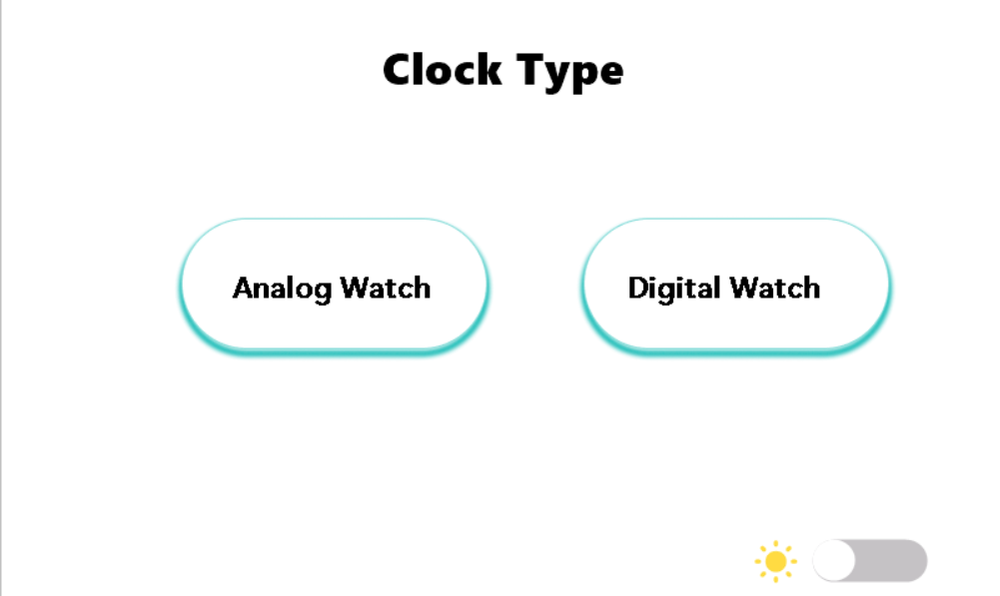
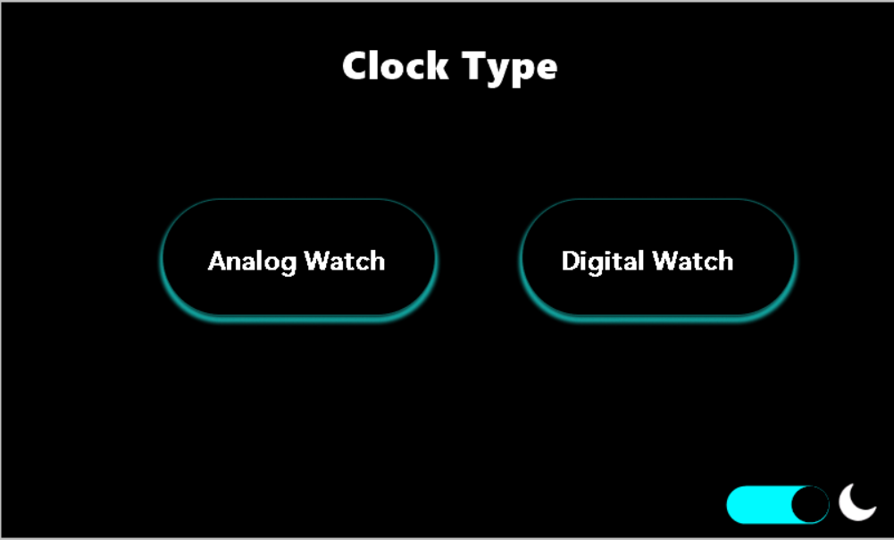
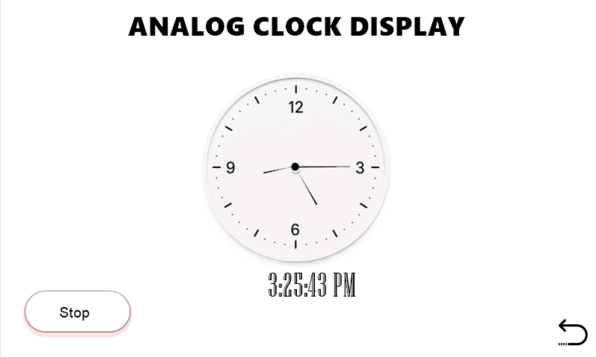
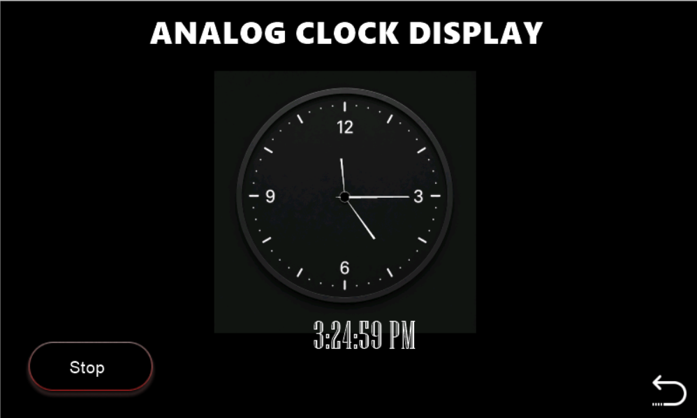
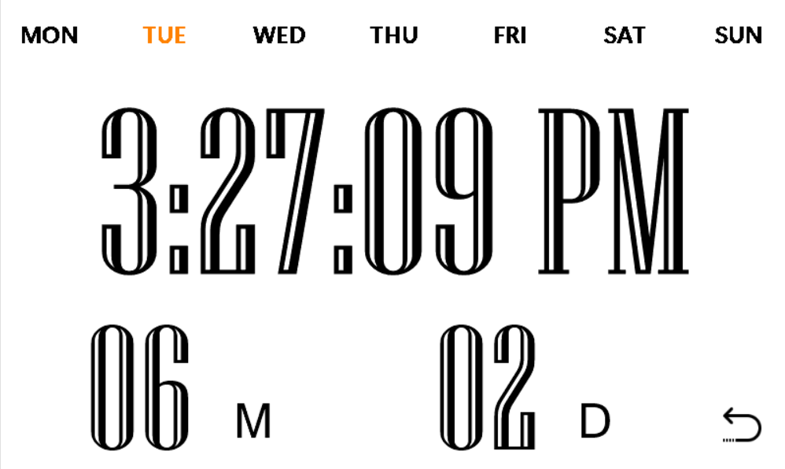
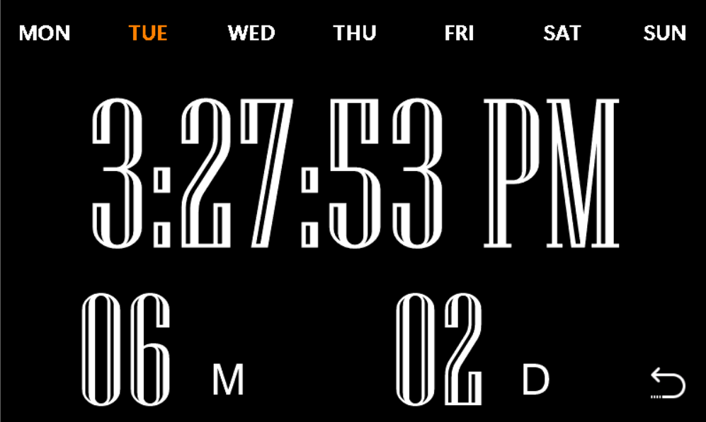
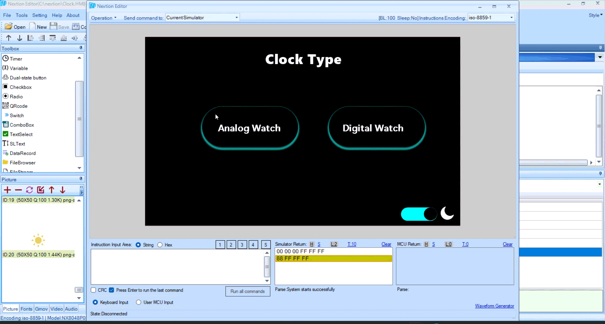

# SmartClock-HMI
A modern Smart Clock Human Machine Interface (HMI) developed using the Nextion Display and RTC integration. The project features Analog and Digital clock interfaces, Light and Dark themes, day highlighting, AM/PM formatting, and real-time date monitoring.

## Introduction

This project is a Smart Clock Human Machine Interface (HMI) designed using the Nextion Editor. The system provides both Analog and Digital clock interfaces synchronized using the Real-Time Clock (RTC). It features Light and Dark themes, dynamic day highlighting, AM/PM time format, and real-time date display. The project demonstrates modern HMI design principles, RTC integration, and embedded user interface development.

## Components

* RTC (Built-in RTC)
* Nextion Editor
* Personal Computer / Laptop

## Method

The clock continuously reads RTC values including Hours, Minutes, Seconds, Day, Month, and Date. These values are processed using Nextion scripting and displayed in both Analog and Digital clock formats.

The Analog Clock updates the hour, minute, and second hands according to RTC values, while the Digital Clock displays time in 12-hour format with AM/PM indication. Users can switch between Light and Dark themes through an interactive toggle interface.

## Technologies Used

* Nextion Editor
* HMI Design
* RTC Integration
* Embedded Scripting
* UI/UX Design
* Real-Time Data Visualization

## Applications

* Smart Desk Clocks
* Home Automation Dashboards
* Educational Embedded Projects
* Industrial HMI Systems
* RTC-Based Monitoring Systems
* Smart Display Interfaces

## The Project Involved

* Custom HMI screen design
* Analog clock development
* Digital clock development
* RTC synchronization
* Day highlighting implementation
* Light and Dark theme switching
* AM/PM format implementation
* Date and month formatting
* Nextion scripting and debugging
* User interface optimization

## Snaps of the Project

## Snaps of the Project

### Loading Screen

  

  Clock Startup Loading Screen

---

### Theme Selection Interface

| Light Theme                             | Dark Theme                            |
| --------------------------------------- | ------------------------------------- |
|  |  |

---

### Analog Clock

| Light Theme                       | Dark Theme                      |
| --------------------------------- | ------------------------------- |
|  |  |

---

### Digital Clock

| Light Theme                       | Dark Theme                        |
| --------------------------------- | --------------------------------- |
|  |  |

---

## Live Demonstration

  

  Smart Clock HMI Demonstration

---

